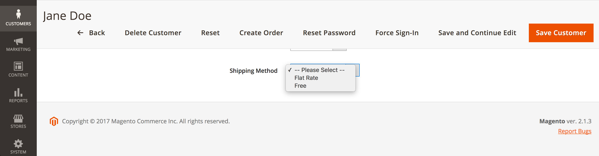

In the current Magento 2 project, the request consists of assigning a predefined shipping method to a customer.

If you are new to the Magento 2 development, you should read Magento's [developer guide](http://devdocs.magento.com/guides/v2.1/extension-dev-guide/build/build.html). I'll only explain the files in which the business logic is happening and not a complete overview of all files like configuration and registration etc.

## User-defined customer attribute

Since we want to configure the shipping method for a customer in the backend, we need a user-defined customer attribute.
Thus, we first need a setup script in which we create the attribute.

**Demo/CustomerShippingMethod/Setup/InstallData.php**
```php
<?php
namespace Demo\CustomerShippingMethod\Setup;

use Magento\Framework\Setup\InstallDataInterface;
use Magento\Framework\Setup\ModuleContextInterface;
use Magento\Framework\Setup\ModuleDataSetupInterface;
use Magento\Customer\Setup\CustomerSetupFactory;
use Magento\Customer\Model\Customer;

class InstallData implements InstallDataInterface
{
    /**
     * @var CustomerSetupFactory
     */
    protected $customerSetupFactory;

    /**
     * @param CustomerSetupFactory $customerSetupFactory
     */
    public function __construct(
        CustomerSetupFactory $customerSetupFactory
    )
    {
        $this->customerSetupFactory = $customerSetupFactory;
    }

	/**
     * @param ModuleDataSetupInterface $setup
     * @param ModuleContextInterface $context
     */
    public function install(ModuleDataSetupInterface $setup, ModuleContextInterface $context) //@codingStandardsIgnoreLine
    {
        $customerSetup = $this->customerSetupFactory->create(['setup' => $setup]);
        $customerSetup->removeAttribute(Customer::ENTITY, 'shipping_method');
        $customerSetup->addAttribute(
            Customer::ENTITY,
            'shipping_method',
            [
                'type' => 'varchar',
                'label' => 'Shipping Method',
                'input' => 'select',
                'source' => 'Demo\CustomerShippingMethod\Model\Attribute\Source\ShippingMethod',
                'required' => false,
                'sort_order' => 0,
                'visible' => true,
                'system' => false,
            ]
        );
        $attribute = $customerSetup->getEavConfig()->getAttribute(Customer::ENTITY, 'shipping_method');
        $attribute->setData(
            'used_in_forms',
            ['adminhtml_customer', 'customer_account_create', 'customer_account_edit', 'adminhtml_checkout']
        );
        $attribute->save();
        $customerSetup->updateAttribute(Customer::ENTITY, 'shipping_method', 'sort_order', 900);
    }
}
```
We defined our own source model in the setup, which we will create next.
The goal should be to get only the active shipping methods, which we can assign later to the customer in the backend.

**Demo/Model/Attribute/Source/ShippingMethod.php**
```php
<?php
namespace Demo\CustomerShippingMethod\Model\Attribute\Source;

use Magento\Eav\Model\Entity\Attribute\Source\AbstractSource;

class ShippingMethod extends AbstractSource
{
    const NONE = '';

    /**
     * @var \Magento\Framework\App\Config\ScopeConfigInterface
     */
    protected $_scopeConfig;

    /**
     * @var \Magento\Shipping\Model\Config
     */
    protected $_shippingConfig;

    /**
     * @param \Magento\Framework\App\Config\ScopeConfigInterface $scopeConfig
     * @param \Magento\Shipping\Model\Config $shippingConfig
     */
    public function __construct(
        \Magento\Framework\App\Config\ScopeConfigInterface $scopeConfig,
        \Magento\Shipping\Model\Config $shippingConfig
    ) {
        $this->_scopeConfig = $scopeConfig;
        $this->_shippingConfig = $shippingConfig;
    }

    /**
     * @return array
     */
    public function getAllOptions()
    {
        if ($this->_options === null) {
            $options = [];
            $options[] = ['label' => __('-- Please Select --'), 'value' => self::NONE];

            $carriers = $this->_shippingConfig->getAllCarriers();
            foreach($carriers as $code => $carrier) {

                if($carrier->isActive() && $carrier->getAllowedMethods()) {
                    $label = $this->_scopeConfig->getValue(
                        'carriers/' . $code . '/title',
                        \Magento\Store\Model\ScopeInterface::SCOPE_STORE
                    );
                    $options[] = ['label' => $label, 'value' => $code];
                }
            }

            $this->_options = $options;
        }
        return $this->_options;
    }

    /**
     * @return array
     */
    public function getOptionArray()
    {
        $_options = [];
        foreach ($this->getAllOptions() as $option) {
            $_options[$option['value']] = $option['label'];
        }
        return $_options;
    }
}
```
If we would activate the module and run the upgrade already, we could see the new attribute in the backend, like below.




## Plugin

But before we get there, we need a plugin. As we only want to output the shipping method assigned to the customer and ignore the rest.

**Demo/CustomerShippingMethod/Plugin/Quote/AddressPlugin.php**
```php
<?php

namespace Demo\CustomerShippingMethod\Plugin\Quote;

use Magento\Customer\Api\CustomerRepositoryInterface;
use Magento\Quote\Model\Quote\Address as Subject;

class AddressPlugin
{
    /**
     * @var CustomerRepositoryInterface
     */
    protected $customerRepository;

    public function __construct(
        CustomerRepositoryInterface $customerRepository
    ) {
        $this->customerRepository = $customerRepository;
    }

    /**
     * @param Subject $subject
     * @param $data
     * @return bool
     */
    public function afterGetGroupedAllShippingRates(Subject $subject, $data)
    {
        if ($subject->getCustomerId()) {
            $customer = $this->customerRepository->getById($subject->getCustomerId());
            if ($shippingMethod = $customer->getCustomAttribute('shipping_method')) {
                foreach ($data as $carrier_code => $carrier_data) {
                    if ($carrier_code !== $shippingMethod->getValue()) {
                        unset($data[$carrier_code]);
                    }
                }
                return $data;
            }
        }
        // don't show a shipping method by default
        return false;
    }
}

```
And the corresponding configuration

**Demo/CustomerShippingMethod/etc/di.xml**

```xml
<?xml version="1.0"?>
<config xmlns:xsi="http://www.w3.org/2001/XMLSchema-instance" xsi:noNamespaceSchemaLocation="urn:magento:framework:ObjectManager/etc/config.xsd">
    <type name="Magento\Quote\Model\Quote\Address">
        <plugin name="demo_customer_shipping_method_address_plugin" type="Demo\CustomerShippingMethod\Plugin\Quote\AddressPlugin" sortOrder="10" disabled="false"/>
    </type>
</config>
```

I've needed a while until I figured out the correct method which can be used for the plugin. I also noticed that the plugin didn't worked in the frontend scope, so I had to place the **di.xml** directly in **/etc**.

I appreciate any comments or suggestions for improvement. So feel free to share your thoughts.

