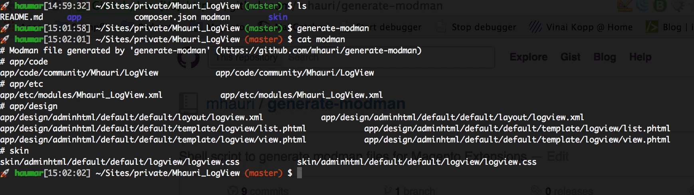

Nearly every day working with extensions, creating a new or extend an existing, it happens that I forget to update the modman file.

This is maybe the reason why I wrote a modman generation script, so I do not longer have to take care about adding all the files or directories manually without any typos.

generate-modman is a shell script who takes care of all that in my daily work routine.

As I’m not the usual shell scripting guy, it had also the purpose to get more fluent in basic shell scripting.

The script takes care with linking files instead of folders in default magento directories so it (hopefully) doesn’t conflict with other extensions, but it also keeps it simple when it handles your work in app/code.

I’m appreciate any feedback and/or your pull-request.

[https://github.com/mhauri/generate-modman](https://github.com/mhauri/generate-modman)
