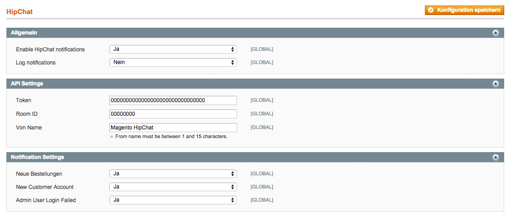
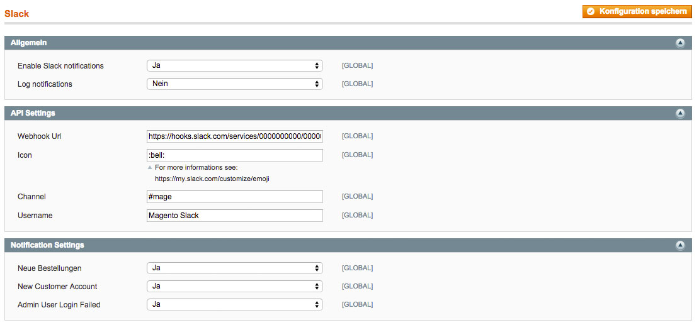

You want to get informed when a customer creates an account, buys a product or a bad guy tries to breach into your Magento admin login in real time, and all this in your preferred Team communication tool like HipChat or Slack,?

Then I have something for you.

For HipChat and for Slack I wrote a Magento extension which allows you to define which information you want to see in a room/channel of your preferred communication tool.

## HipChat

See: [https://github.com/mhauri/magento-hipchat](https://github.com/mhauri/magento-hipchat)

## Slack

See: [https://github.com/mhauri/magento-slack](https://github.com/mhauri/magento-slack)

Any contribution is highly appreciated.