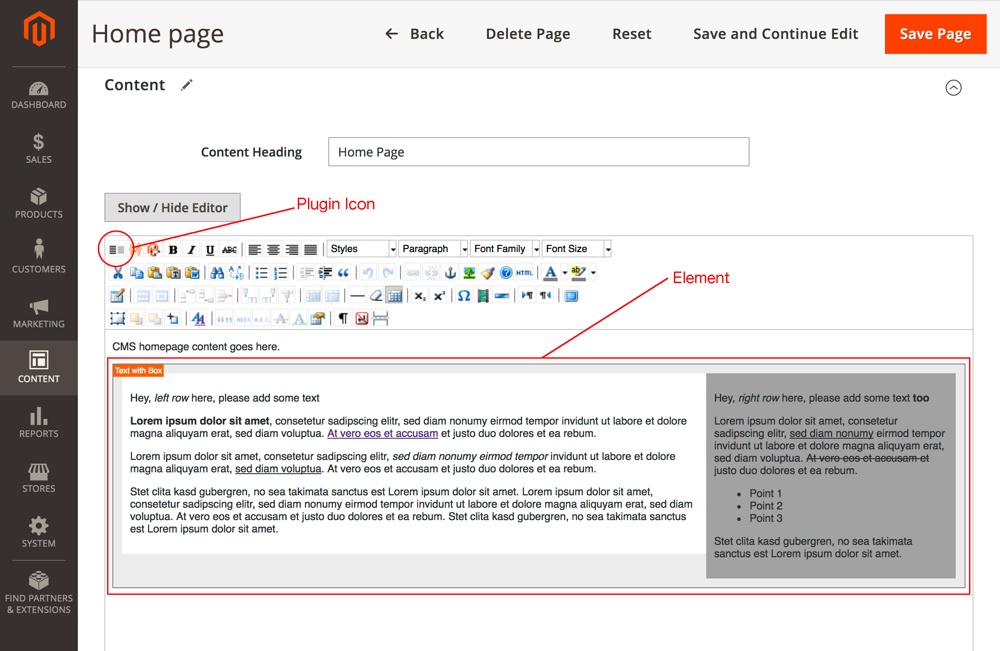
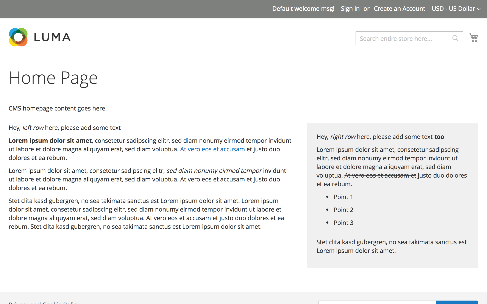

As we all know, the CMS part of Magento 2 is rather modest compared to other CMS systems, especially when it comes to formatting elements. In the meantime, Magento has acquired the technology behind the popular [Bluefoot CMS & Page Builder](https://magento.com/blog/magento-news/magento-acquires-technology-behind-bluefoot-cms-page-builder), but until it is fully integrated into Magento 2 by default, a lot of time will pass by.

Usually we tend to use widgets for elements that require specific formatting. But there are boundaries. For example, a WYSIWYG editor isn’t available within a widget.

So either we have the option to [add the WYSIWYG editor to a widget](http://www.magebuzz.com/blog/magento-2-add-wysiwyg-editor-text-area-in-custom-widget/) which didn't worked for me and is maybe the wrong approach, or we add the specific formatting via a TinyMCE plugin to the Magento 2 WYSIWYG Editor which is much cleaner for editors as they can see and format the content inside the element directly.

## Let's create a TinyMCE Plugin
Creating a TinyMCE plugin is not particularly difficult because it follows a [defined structure](https://www.tinymce.com/docs-3x//customization/TinyMCE3x@Creating_a_plugin/). So our demo plugin will have the following content.

```js
tinyMCE.addI18n({en:{
    textwithbox:
        {
            insert_text_with_box : "Insert text with box"
        }
}});

(function() {
    tinymce.create('tinymce.plugins.TextWithBoxPlugin', {
        /**
         * @param {tinymce.Editor} ed Editor instance that the plugin is initialized in.
         * @param {string} url Absolute URL to where the plugin is located.
         */
        init : function(ed, url) {
            var t = this;
            t.editor = ed;
            ed.contentCSS = [ed.settings.magentoPluginsOptions._object.textwithbox.css];
            ed.addCommand('mceTextwithbox', t._insertTextWithBox, t);
            ed.addButton('textwithbox', {
                title : 'textwithbox.insert_text_with_box',
                cmd : 'mceTextwithbox',
                image : url + '/img/icon.gif'
            });
        },

        getInfo : function() {
            return {
                longname : 'Demo Text with Box Plugin for TinyMCE 3.x',
                author : 'Marcel Hauri',
                authorurl : 'https://blog.hauri.me/how-to-add-a-tinymce-plugin-to-the-magento2-wysiwyg-editor.html',
                infourl : 'https://github.com/mhauri/magento2-demo-tinymce-plugin',
                version : "1.0"
            };
        },

        _insertTextWithBox : function () {
            var ed = this.editor;
            ed.execCommand('mceInsertContent', false, '<div class="textwithbox">' +
                '<div class="textwithbox-left">Left ...</div>' +
                '<div class="textwithbox-right">Right ...</div>' +
                '</div>');
        }
    });

    // Register plugin
    tinymce.PluginManager.add('textwithbox', tinymce.plugins.TextWithBoxPlugin);
})();

````
The actual functionality is defined in the method ```_insertTextWithBox``` where we can define how our element will be structured. For demo purposes I want to have text on left side, and a gray box with text on the right side.

That was the easy part, now we have to add our TinyMCE plugin to the WYSIWYG Editor. 
The current Plugins like ```magentowidget``` or ```magentovairables``` are defined by default in the ```magento2-base/lib/web/mage/adminhtml/wysiwyg/tiny_mce/setup.js``` file. As this is a core file and we don't want to override it we have to find another way. Luckily the Magento CMS comes with a method called ```getConfig()``` which allows us to get the current WYSIWYG configuration.

## Create a Magento Plugin
As we know now which method to use we can hook-in with a Magento plugin by using the ```afterGetConfig()``` method.
In this method we extend the configuration with our Plugin settings coming from our ```TextWithBox``` model and return the results.

```php
<?php

namespace Demo\TinyMcePlugin\Plugin\Wysiwyg;

use Magento\Cms\Model\Wysiwyg\Config as Subject;
use Magento\Framework\DataObject;
use Demo\TinyMcePlugin\Model\Wysiwyg\TextWithBox;

class ConfigPlugin
{
    /**
     * @var TextWithBox
     */
    private $textWithBox;

    /**
     * ConfigPlugin constructor.
     * @param TextWithBox $textWithBox
     */
    public function __construct(
        TextWithBox $textWithBox
    ) {
        $this->textWithBox = $textWithBox;
    }

    /**
     * @SuppressWarnings(PHPMD.UnusedFormalParameter)
     */
    public function afterGetConfig(Subject $subject, DataObject $config) : DataObject
    {
        $textWithBoxPluginSettings = $this->textWithBox->getPluginSettings($config);
        $config->addData($textWithBoxPluginSettings);
        return $config;
    }
}
```

## TextWithBox model
The model provides the information which are needed to add our TinyMCE plugin to the configuration.

```php
<?php

namespace Demo\TinyMcePlugin\Model\Wysiwyg;

use Magento\Framework\DataObject;

class TextWithBox
{
    const PLUGIN_NAME = 'textwithbox';

    /**
     * @var \Magento\Framework\View\Asset\Repository
     */
    protected $assetRepo;

    /**
     * TextWithBox constructor.
     * @param \Magento\Framework\View\Asset\Repository $assetRepo
     */
    public function __construct(
        \Magento\Framework\View\Asset\Repository $assetRepo
    ) {
        $this->assetRepo = $assetRepo;
    }

    public function getPluginSettings(DataObject $config) : array
    {
        $plugins = $config->getData('plugins');
        $plugins[] = [
                'name' => self::PLUGIN_NAME,
                'src' => $this->getPluginJsSrc(),
                'options' => [
                    'title' => __('Text with Box'),
                    'class' => 'add-text-with-box plugin',
                    'css' => $this->getPluginCssSrc()
                ],
            ];

        return ['plugins' => $plugins];
    }

    private function getPluginJsSrc() : string
    {
        return $this->assetRepo->getUrl(
            sprintf('Demo_TinyMcePlugin::js/tiny_mce/plugins/%s/editor_plugin.js', self::PLUGIN_NAME)
        );
    }

    private function getPluginCssSrc() : string
    {
        return $this->assetRepo->getUrl(
            sprintf('Demo_TinyMcePlugin::css/tiny_mce/plugins/%s/content.css', self::PLUGIN_NAME)
        );
    }
}

```

## The Result




## Source & Download
You can find the complete source on GitHub: 
[https://github.com/mhauri/magento2-demo-tinymce-plugin](https://github.com/mhauri/magento2-demo-tinymce-plugin)
