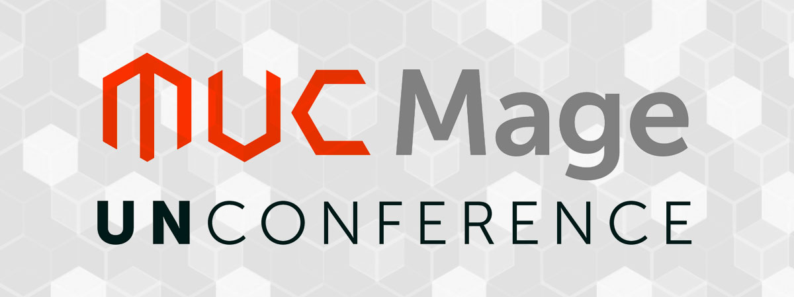

Next month the third [Mage Unconference](http://www.mageunconference.org/2017/) will take place from 04th–05th March 2017 at the start-up incubator and cowering space [Startplatz](http://www.startplatz.de/en/) in Cologne.

For me it will be some of firsts. It will be my first Magento Unconference and it will be the first visit of Cologne. 
Therefore I will spend a few days in addition before and after the Unconference to visit Cologne together with my wife. So if you know some places we must have seen before leaving Cologne, leave me a comment.

I am looking forward to the Unconference and the days in Cologne and I hope to meet a lot of familiar and new faces, spending time together to discuss, to talk and to have a lot of fun. Hope to see you there.