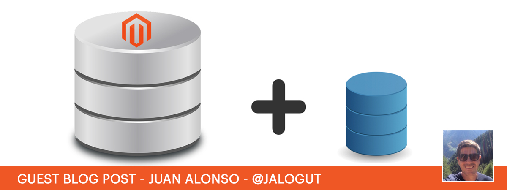

<span class="guest">This is a guest blog post by [Juan Alonso](https://twitter.com/Jalogut), he is 4x Magento Certified and a Senior Software Engineer at [advandoo AG](https://advandoo.com)</span>

Adding a custom database connection in Magento2 seems easy at first but doing it properly it is a bit more complicated. Here I will explain how to do it right.

Normally, if you want to add a new database connection in your Magento 2 project, you will tend to do only the following. That is at least what I also did in the past 😅

1. Edit `app/etc/env.php` with new database connection 

    ```php
    'db' => array (
        'connection' => array (
        	//...
            'custom' => array (
                'host' => '<host>',
                'dbname' => '<database>',
                'username' => '<user>',
                'password' => '<password>',
                'active' => '1',
            ),
        ),
    ),
    'resource' => array(
    	//...
        'custom' => array(
          'connection' => 'custom'
        )
    )
    ```

2. Use the new connection in your `model/resource`, or wherever you want, by specifying the custom resource connection:

    * In your Model Resources

    ```php
    public function __construct(Context $context, $connectionName = 'custom')
    {
        parent::__construct($context, $connectionName);
    }
    ```

    * At any other place

    ```php
    /** @var Magento\Framework\App\ResourceConnection $this->resourceConnection **/
    $connection = $this->resourceConnection->getConnection('custom');
    ```

Quite easy, right? After that, you get your module working with the new database connection. However, if you want to do it the right way, that is not enough. Otherwise, why would we write this post?

If you only do that, you will face 2 issues:

1. This new database connection will not be available for integration tests
2. Clean installations will crash if your module contains a setup script that uses this database. For example if you create/alter tables on this database using setup scripts.

The solution to overcome these problems is to add the configuration automatically into `app/etc/env.php`, the same way as the `default_setup` is added by default in Magento2. That way, our custom database configuration will always be available for clean installations and integration tests.

Good news is that Magento 2 is already prepared to allow other modules to extend the default `setup:install` command, in order to execute custom actions on setup time. The key is in `Magento\Setup\Model\ConfigOptionsListCollector::collectOptionsLists`

```php
/**
 * Auto discover ConfigOptionsList class and collect them.
 * These classes should reside in <module>/Setup directories.
 */
public function collectOptionsLists()
{
    $optionsList = [];

    // go through modules
    foreach ($this->fullModuleList->getNames() as $moduleName) {
        $optionsClassName = str_replace('_', '\\', $moduleName) . '\Setup\ConfigOptionsList';
        if (class_exists($optionsClassName)) {
            $optionsClass = $this->objectManagerProvider->get()->create($optionsClassName);
            if ($optionsClass instanceof ConfigOptionsListInterface) {
                $optionsList[$moduleName] = $optionsClass;
            }
        }
    }
}
```

As you can see on previous function, this `collectOptionsLists` loads all module classes with namespace `\Setup\ConfigOptionsList`. Knowing that, we need to create our own `ConfigOptionsList` with the logic to create our custom database configuration. Our class will be as follows:

`Vendorname\Modulename\SetupConfigOptionsList`

```php
<?php
/**
 * ConfigOptionsList
 *
 */
namespace Vendorname\Modulename\Setup;

use Magento\Framework\Config\Data\ConfigData;
use Magento\Framework\Config\File\ConfigFilePool;
use Magento\Framework\Setup\ConfigOptionsListInterface;
use Magento\Framework\Setup\Option\TextConfigOption;
use Magento\Framework\App\DeploymentConfig;
use Magento\Framework\Config\ConfigOptionsListConstants;
use Magento\Setup\Exception as SetupException;
use Magento\Framework\Model\ResourceModel\Type\Db\ConnectionFactory;

class ConfigOptionsList implements ConfigOptionsListInterface
{
    const DB_CONNECTION_NAME = 'custom';
    const DB_CONNECTION_SETUP = self::DB_CONNECTION_NAME;
    const CONFIG_PATH_DB_CONNECTION = ConfigOptionsListConstants::CONFIG_PATH_DB_CONNECTIONS . '/' . self::DB_CONNECTION_NAME;
    const CONFIG_PATH_RESOURCE_SETUP = ConfigOptionsListConstants::CONFIG_PATH_RESOURCE . '/' . self::DB_CONNECTION_SETUP . '/connection';
    const OPTION_DB_HOST = self::DB_CONNECTION_NAME . '-db-host';
    const OPTION_DB_NAME = self::DB_CONNECTION_NAME . '-db-name';
    const OPTION_DB_USER = self::DB_CONNECTION_NAME . '-db-user';
    const OPTION_DB_PASSWORD = self::DB_CONNECTION_NAME . '-db-password';
    const OPTION_DB_ENGINE = self::DB_CONNECTION_NAME . '-db-engine';
    const OPTION_DB_INIT_STATEMENTS = self::DB_CONNECTION_NAME . '-db-init-statements';

    const OPTIONAL_OPTIONS = [
        ConfigOptionsListConstants::KEY_HOST => self::OPTION_DB_HOST,
        ConfigOptionsListConstants::KEY_NAME => self::OPTION_DB_NAME,
        ConfigOptionsListConstants::KEY_USER => self::OPTION_DB_USER,
        ConfigOptionsListConstants::KEY_PASSWORD => self::OPTION_DB_PASSWORD,
        ConfigOptionsListConstants::KEY_ENGINE => self::OPTION_DB_ENGINE,
        ConfigOptionsListConstants::KEY_INIT_STATEMENTS => self::OPTION_DB_INIT_STATEMENTS,
    ];

    protected $connectionFactory;

    public function __construct(
        ConnectionFactory $connectionFactory
    ) {
        $this->connectionFactory = $connectionFactory;
    }

    public function getOptions()
    {
        return [
            new TextConfigOption(
                self::OPTION_DB_HOST,
                TextConfigOption::FRONTEND_WIZARD_TEXT,
                self::CONFIG_PATH_DB_CONNECTION . '/' . ConfigOptionsListConstants::KEY_HOST,
                'Database host (Connection name: Import)',
                'localhost'
            ),
            new TextConfigOption(
                self::OPTION_DB_NAME,
                TextConfigOption::FRONTEND_WIZARD_TEXT,
                self::CONFIG_PATH_DB_CONNECTION . '/' . ConfigOptionsListConstants::KEY_NAME,
                'Database name (Connection name: Import)',
                'magento2_import'
            ),
            new TextConfigOption(
                self::OPTION_DB_USER,
                TextConfigOption::FRONTEND_WIZARD_TEXT,
                self::CONFIG_PATH_DB_CONNECTION . '/' . ConfigOptionsListConstants::KEY_USER,
                'Database username (Connection name: Import)',
                'root'
            ),
            new TextConfigOption(
                self::OPTION_DB_PASSWORD,
                TextConfigOption::FRONTEND_WIZARD_PASSWORD,
                self::CONFIG_PATH_DB_CONNECTION . '/' . ConfigOptionsListConstants::KEY_PASSWORD,
                'Database password (Connection name: Import)',
                ''
            ),
            new TextConfigOption(
                self::OPTION_DB_ENGINE,
                TextConfigOption::FRONTEND_WIZARD_TEXT,
                self::CONFIG_PATH_DB_CONNECTION . '/' . ConfigOptionsListConstants::KEY_ENGINE,
                'Database engine (Connection name: Import)',
                'innodb'
            ),
            new TextConfigOption(
                self::OPTION_DB_INIT_STATEMENTS,
                TextConfigOption::FRONTEND_WIZARD_TEXT,
                self::CONFIG_PATH_DB_CONNECTION . '/' . ConfigOptionsListConstants::KEY_INIT_STATEMENTS,
                'Database initial set of commands (Connection name: Import)',
                'SET NAMES utf8;'
            ),
        ];
    }

    public function createConfig(array $options, DeploymentConfig $deploymentConfig)
    {
        $configData = new ConfigData(ConfigFilePool::APP_ENV);

        $dbConfig = $this->getDbConfig($options, $deploymentConfig);
        foreach ($dbConfig as $configSubPath => $configValue) {
            $configData->set(self::CONFIG_PATH_DB_CONNECTION . '/' . $configSubPath, $configValue);
        }

        if ($deploymentConfig->get(self::CONFIG_PATH_RESOURCE_SETUP) === null) {
            $configData->set(self::CONFIG_PATH_RESOURCE_SETUP, self::DB_CONNECTION_NAME);
        }

        return [$configData];
    }

    protected function getDbConfig(array $options, DeploymentConfig $deploymentConfig) : array
    {
        $dbConfig = [];
        foreach (self::OPTIONAL_OPTIONS as $configSubPath => $option) {
            if ($options[$option] === null) {
                $options[$option] = $deploymentConfig->get(self::CONFIG_PATH_DB_CONNECTION . '/' . $configSubPath);
            }
            $dbConfig[$configSubPath] = $options[$option];
        }

        $activeConfigPath = self::CONFIG_PATH_DB_CONNECTION . '/' . ConfigOptionsListConstants::KEY_ACTIVE;
        $dbConfig[ConfigOptionsListConstants::KEY_ACTIVE] = $deploymentConfig->get($activeConfigPath)??'1';

        return $dbConfig;
    }

    public function validate(array $options, DeploymentConfig $deploymentConfig)
    {
        if (!$options[ConfigOptionsListConstants::INPUT_KEY_SKIP_DB_VALIDATION]) {
            try {
                $dbConfig = $this->getDbConfig($options, $deploymentConfig);
                $this->checkDatabaseConnection($dbConfig);
            } catch (\Exception $e) {
                $errors = [
                    sprintf('Error validating DB connection name: "%s"', self::DB_CONNECTION_NAME),
                    $e->getMessage()
                ];
                return $errors;
            }
        }
        return [];
    }

    /**
     * @param array $dbConfig
     * @return bool
     * @throws SetupException
     */
    protected function checkDatabaseConnection(array $dbConfig)
    {
        $connection = $this->connectionFactory->create($dbConfig);
        $dbName = $dbConfig[ConfigOptionsListConstants::KEY_NAME];

        $accessibleDbs = $connection
            ->query("SHOW DATABASES")
            ->fetchAll(\PDO::FETCH_COLUMN, 0); //@codingStandardsIgnoreLine
        if (in_array($dbName, $accessibleDbs)) {
            return true;
        }

        throw new SetupException(
            sprintf("Database '%s' does not exist or user does not have privileges to access this database.", $dbName)
        );
    }
}
``` 


Let's break down what we are doing here:

1. Our class must implement `ConfigOptionsListInterface`. Checking this interface, we see that we have to implement 3 methods:

    ```php
    interface ConfigOptionsListInterface
    {
        /**
         * Gets a list of input options so that user can provide required
         * information that will be used in deployment config file
         */
        public function getOptions();
    
        /**
         * Creates array of ConfigData objects from user input data.
         * Data in these objects will be stored in array form in deployment config file.
         */
        public function createConfig(array $options, DeploymentConfig $deploymentConfig);
    
        /**
         * Validates user input option values and returns error messages
         */
        public function validate(array $options, DeploymentConfig $deploymentConfig);
    }
    ```

2. Implement method `getOptions()`. Here is where we specify new options that will be available when executing `install:setup`. For a new database connection we will add following options:

    ```bash
    --custom-db-host                Database host (Connection name: Custom)
    --custom-db-name                Database name (Connection name: Custom)
    --custom-db-user                Database username (Connection name: Custom)
    --custom-db-password            Database password (Connection name: Custom)
    --custom-db-engine              Database engine (Connection name: Custom)
    --custom-db-init-statements     Database initial set of commands (Connection name: Custom)
    ```

	Each option must be type `TextConfigOption` as in the following example:

    ```php
    public function getOptions()
    {
        return [
            new TextConfigOption(
                self::OPTION_DB_HOST,
                TextConfigOption::FRONTEND_WIZARD_TEXT,
                self::CONFIG_PATH_DB_CONNECTION . '/' . ConfigOptionsListConstants::KEY_HOST,
                'Database host (Connection name: Import)',
                'localhost'
            ),
       //...
       ];
    }
    ```

3. Implement method `validate()`. Here we check database settings by trying to connect to the custom database. Validation will return errors if connection could not be established.

    ```php
	public function validate(array $options, DeploymentConfig $deploymentConfig)
    {
        if (!$options[ConfigOptionsListConstants::INPUT_KEY_SKIP_DB_VALIDATION]) {
            try {
                $dbConfig = $this->getDbConfig($options, $deploymentConfig);
                $this->checkDatabaseConnection($dbConfig);
            } catch (\Exception $e) {
                $errors = [
                    sprintf('Error validating DB connection name: "%s"', self::DB_CONNECTION_NAME),
                    $e->getMessage()
                ];
                return $errors;
            }
        }
        return [];
    }
    ```

4. Implement method `createConfig()`. Finally the method that we were looking for. Here it is where we save the custom database settings into the `app/etc/env.php` configuration file:

    ```php
	public function createConfig(array $options, DeploymentConfig $deploymentConfig)
    {
        $configData = new ConfigData(ConfigFilePool::APP_ENV);

        $dbConfig = $this->getDbConfig($options, $deploymentConfig);
        foreach ($dbConfig as $configSubPath => $configValue) {
            $configData->set(self::CONFIG_PATH_DB_CONNECTION . '/' . $configSubPath, $configValue);
        }

        if ($deploymentConfig->get(self::CONFIG_PATH_RESOURCE_SETUP) === null) {
            $configData->set(self::CONFIG_PATH_RESOURCE_SETUP, self::DB_CONNECTION_NAME);
        }

        return [$configData];
    }

    ```

And we are done! Clean installations and integration tests will now include our custom database settings automatically during setup.


Executing `setup:install --help` will show the new command options. The same way, if we do a new installation, we'll see that the custom database configuration gets automatically added into the `app/etc/env.php`.

This has the following advantages:

1. You can now add setup scripts that affect your custom database without crashing clean installations. `env.php` is now edited during the `setup:install`, so your custom database configuration is ready before the setup scripts are executed.

2. You can run integration tests that use your custom database. For that, you need to edit `dev/tests/integration/etc/install-config-mysql.php` with new options

	```php
  	return [
        //...
        'custom-db-host' => '<host>',
        'custom-db-user' => '<user>',
        'custom-db-password' => '<password>',
        'custom-db-name' => '<custom_database>_integration_tests',
    ];
    ```

One last tip. If you want to skip the hassle of creating this code manually, you can use the [magento2-code-generation](https://github.com/staempfli/magento2-code-generator) tool to generate it automatically:

```bash
mg2-codegen template:generate customDBConnection
```

That's all. I hope this will help you when you add your custom databases. It was not so easy for me to find out the right way to do it but it was great to see that Magento2 is properly prepared for it.
