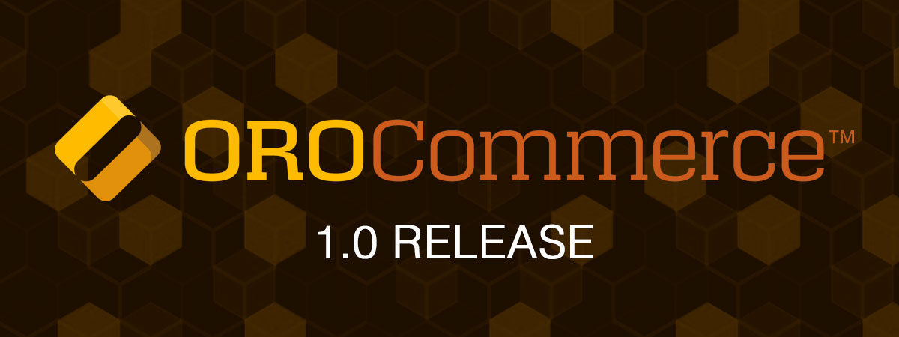

The first release of Orocommerce, the long-announced B2B e-commerce solution, is now available. The e-commerce solution has been built from the ground to solve the specific needs of B2B eCommerce, so the company promises no less than a revolution of the B2B market.

Behind Oro are Magento founders Yoav Kutner and Roy Rubin, former Magento manager Jary Carter and the former lead architect of Magento Dima Soroka.

## Built From the Ground Up for B2B

With OroCommerce, [Oro is now launching](https://www.orocommerce.com/blog/true-b2b-ecommerce-platform-arrived-orocommerce-1-0-release-now-available) a platform that can meet the complex requirements of the B2B market. 
Including: Multiple and customizable price lists and personalized catalogues, seamless management of buyer-seller interaction, managing Corporate accounts with multiple users, roles and permissions an optimized store front-end for B2B buying experience and automated business processes for multiple customers and channels.

As the platform is [open source](https://github.com/orocommerce/orocommerce-application) and it can be linked to existing business applications such as ERP, CRM and product information tools. At the same time, it also offers an intuitive, user-friendly front-end for buyers.

Similar to Magneto, OroCommerce 1.0 is available in two versions,** Community Edition (CE)** for small emerging businesses and **Enterprise Edition (EE)** for medium to large enterprises. 

Compared to Community Edition the Enterprise Edition offers superior product support, enhanced performance and scalability, and access to features required by large and growing organizations.

## Download
```bash
git clone --recursive -b 1.0.0 https://github.com/orocommerce/orocommerce-application.git
```
Alternative download methods are available on the [OroCommerce download](https://www.orocommerce.com/download) site.