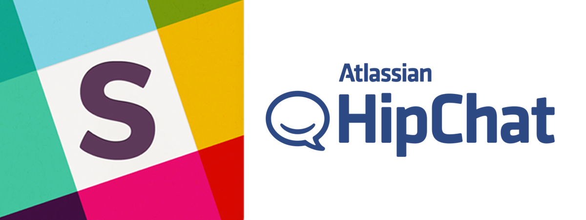
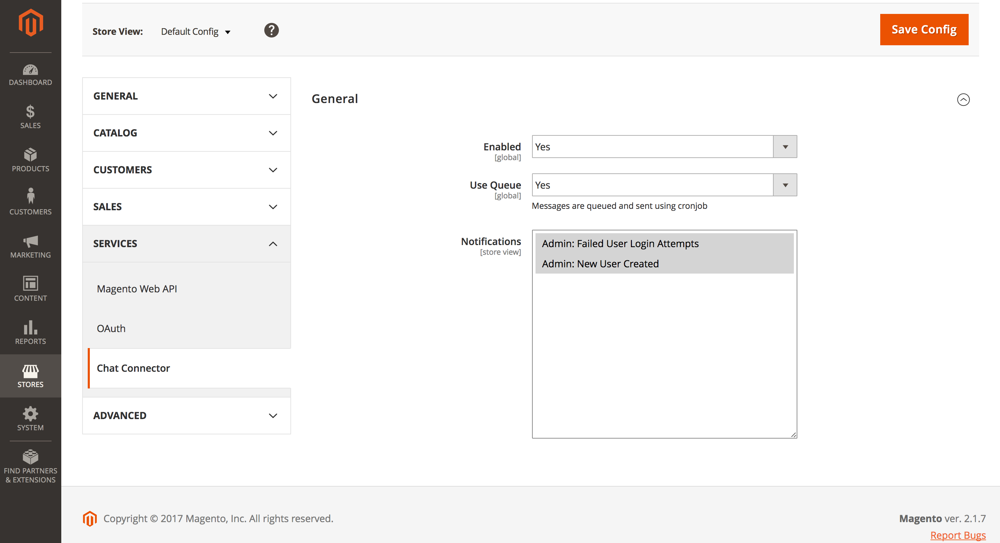
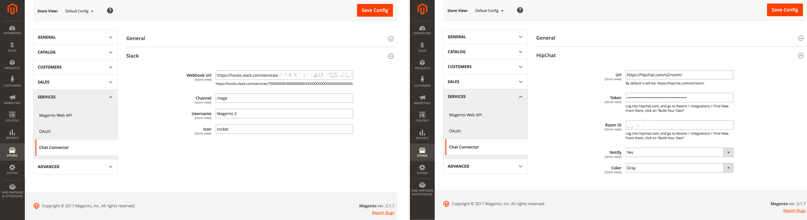

A bit more than two years ago, I wrote the [Slack](https://github.com/mhauri/magento-slack) and [HipChat](https://github.com/mhauri/magento-hipchat) Extensions for Magento 1, which gained [some popularity](https://twitter.com/mhauri/status/866982941322334208). 
Today I released the completely rewritten version of these Modules for the latest Magento 2 version. 

## What’s new? 

First of all I decoupled the queueing and sending part from the individual modules and placed it into an separate module, the [Chat Connector](https://github.com/staempfli/magento2-module-chat-connector). The module listens to several events, which can be enabled or disabled in the backend and handles the queueing and sending of the notifications. 



It also triggers a custom event called `chatconnetor_notify` on which each individual module will listen to and enrich the Notification Message with the needed Payload informations based on the module configuration.

Due the fact that the Chat Connector handles nearly all logic, the individual modules now only contain the service-specific configurations and an observer which listens to the custom `chatconnector_notify` event and prepares the payload before transfering it to the [Chat Connector](https://github.com/staempfli/magento2-module-chat-connector) wich will do the rest as described above



Another benefit is that you can install them in parallel, so if as an example your customer uses Slack and your developers use HipChat you can inform both about what's happening on the shop.

## What's next
The current plan is to extend the documentation and adding more events like, customer registration, inform about new product reviews and so on. If you have an idea abot events which should be added I highly appreciate if you create a [Pull Request](https://github.com/staempfli/magento2-module-chat-connector/pulls).

## Where to get them?
Everything is on [GitHub](https://github.com/staempfli), so you can either download it there directly or install it via composer.

**Slack Module**
```
$ composer require "staempfli/magento2-module-slack":"~1.0"
```
[https://github.com/staempfli/magento2-module-slack](https://github.com/staempfli/magento2-module-slack)

**HipChat Module**
```
$ composer require "staempfli/magento2-module-hipchat":"~1.0"
```
[https://github.com/staempfli/magento2-module-hipchat](https://github.com/staempfli/magento2-module-hipchat)

**Chat Connector**

As already said above it is not intended to install this module by itself, since it only manages the part for sending but does not provide any configuration for HipChat, Slack or similar chat software. If you are using Slack or HipChat, install the appropriate modules.

[https://github.com/staempfli/magento2-module-chat-connector](https://github.com/staempfli/magento2-module-chat-connector)