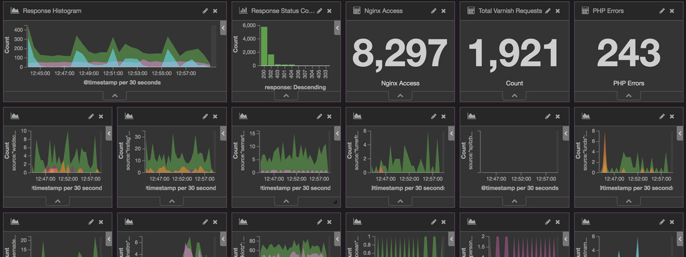
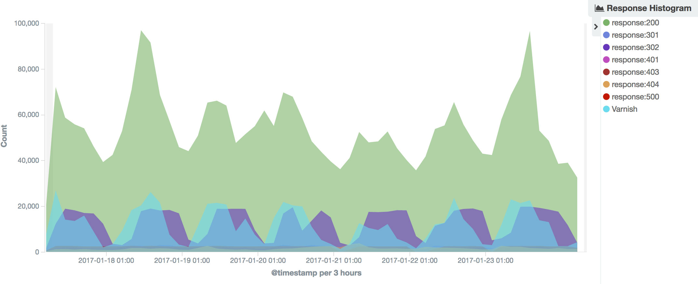
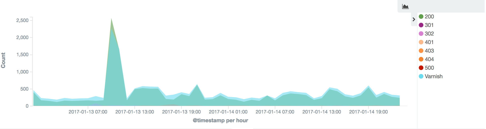

Well, none of us spends his days reading and analyzing logs, at least not as long as everything seems to be fine. If there is a problem, however, it is often shown that this has already been announced at an early stage and that it could have been prevented if it were detected in time.

Here it is useful, besides of an well working monitoring, to centralize and visualize the logs. Only by this way we can bring abstract data and relationships into a visually recognizable form.

## Seeing the big picture

Once the data has been centralized and visualized, you get a rough overview of what happens on the systems and websites.

Response Histogram with requests over the last 7 days.

By using graphical representations, we are able to see large amounts of data in a clear, cohesive manner and draw conclusions from this information. A team of neuroscientists from MIT has found that the human brain can process entire images that the eye sees for as little as 13 milliseconds [Source: [In the blink of an eye](http://news.mit.edu/2014/in-the-blink-of-an-eye-0116)].

This means, it is also much faster to analyze information in graphical format (as opposed to analyzing information in files) and we are able to address problems or answer questions in a more timely manner.

## Identify patterns

Even extensive amounts of complicated data start to make sense when presented graphically
because our ability to identify patterns and correlations when dealing with numbers is incredibly poorer than our ability to recognize and compare shapes.

The response histogram shown above tells us that the traffic during the night is usually lower than during the rest of the day. The same applies generally also for the weekends. But, if we look more closely, we can see that some websites and shops have a much higher traffic on the weekend.

Traffic on a Magento 2 shop over the weekend

Of course, this peak can also come from a web crawler, but now we can see how much traffic the server needs to cope with within a short period of time.

## Communicate to others

A further advantage of the visualization is, that even technical  less experienced understands faster why, as example, a website is currently slightly slower than usual. By using charts, graphs or other visually impactful representations of data it is more engaging and communicates the message across quickly.

## Architecture

The setup we currently use at [Stämpfli AG](http://www.staempfli.com/) is relatively simple. In addition to a monitoring, we use the so-called [Elastic Stack](https://www.elastic.co/de/products). Which I gladly explain in a further blog post.

If you have any questions or suggestions, please leave a comment!